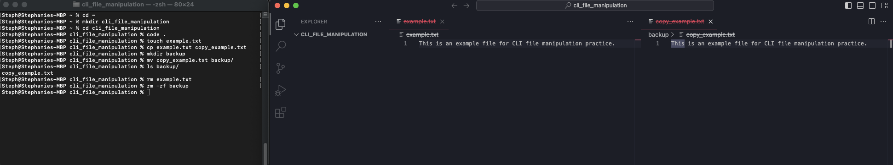

# Basic CLI File Manipulation


##

## Description 📄

In this activity, you will be building off of the CLI navigation commands you learned in the previous activity while adding onto that knowledge by exploring basic CLI (Command-Line Interface) file manipulation commands. You’ll learn how to create files, move, copy, and delete files and directories using commands like `touch`, `mv`, `cp`, and `rm`.

By the end of this exercise, you should feel confident using these commands to manage files and directories in a command-line environment.

## Expected Project Structure 🏗️

```plaintext
cli_file_manipulation/
├── example.txt
└── backup/
    └── copy_example.txt
```

# Instructions ✅

## 1. **Create the Project Folder**
   - [ ] Navigate to the Home Directory
   - [ ] Create a folder named `cli_file_manipulation` to store all your project files:

```bash
mkdir cli_file_manipulation
```

**Explanation:**
- `mkdir cli_file_manipulation` creates a new directory named `cli_file_manipulation`.

## 2. **Navigate into the Project Folder**
   - [ ] Change your working directory to the newly created `cli_file_manipulation` directory:

```bash
cd cli_file_manipulation
```

**Explanation:**
- `cd cli_file_manipulation` changes the current directory to `cli_file_manipulation`.

## 3. **Open the Directory in Visual Studio Code**
   - [ ] Open your `cli_file_manipulation` directory in Visual Studio Code by using the following command:

```bash
code .
```

**Explanation:**
- `code .` opens the current directory (`cli_file_manipulation`) in Visual Studio Code. If VS Code is not installed, this command will not work, and you may need to install it or open the directory manually.

## 4. **Create an Example File**
   - [ ] Create a new text file named `example.txt` using the `touch` command:

```bash
touch example.txt
```

**Explanation:**
- `touch example.txt` creates an empty file named `example.txt` in the current directory.

## 5. **Add Content to the File**
   - [ ] Open the `example.txt` file and add the following content:

```plaintext
This is an example file for CLI file manipulation practice.
```

**Explanation:**
- Open the file inside of VS Code and manually add the text for demo.

## 6. **Copy the File**
   - [ ] Copy the `example.txt` file to create a new file named `copy_example.txt` using the `cp` command:

```bash
cp example.txt copy_example.txt
```

**Explanation:**
- `cp example.txt copy_example.txt` creates a copy of `example.txt` and names it `copy_example.txt`.

## 7. **Move the Copied File**
   - [ ] Move the `copy_example.txt` file to a new directory named `backup`:

```bash
mkdir backup
mv copy_example.txt backup/
```

**Explanation:**
- `mkdir backup` creates a new directory named `backup`.
- `mv copy_example.txt backup/` moves the copied file into the `backup` directory.

## 8. **List the Contents of the Directory**
   - [ ] List the contents of the `backup` directory to verify that the file was moved successfully:

```bash
ls backup/
```

**Explanation:**
- `ls backup/` lists the contents of the `backup` directory, showing that `copy_example.txt` is now in this directory.

## 9. **Delete the Original File**
   - [ ] Delete the original `example.txt` file using the `rm` command:

```bash
rm example.txt
```

**Explanation:**
- `rm example.txt` deletes the `example.txt` file from the current directory.

## 10. **Delete the Backup Directory**
   - [ ] Delete the `backup` directory and its contents using the `rm -rf` command:

```bash
rm -rf backup
```

**Explanation:**
- `rm -rf backup` recursively deletes the `backup` directory and all its contents. The `-rf` is required to delete directories.

##

**Great job! You’ve successfully used basic CLI commands to manipulate files and directories.**

# Conclusion 📄

In this activity, you learned how to perform basic file manipulation tasks in the command line using commands like `touch`, `mv`, `cp`, and `rm`. These commands are fundamental for managing files and directories efficiently in a terminal environment. Mastering these will improve your workflow and prepare you for more advanced CLI operations in the future.

Remember to use your AI assistant to ask questions and troubleshoot issues.

---
© All rights reserved to ThriveDX
